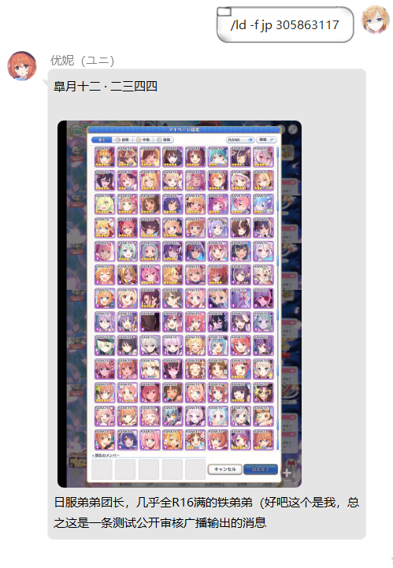
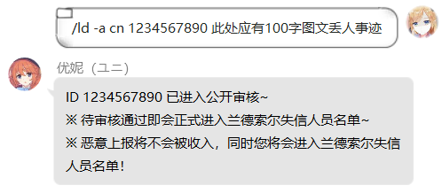
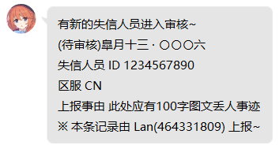

# Landsol Distrust 兰德索尔失信人员名单
* 此为 Lancercmd / Yuni 的功能 Landsol Distrust 的公开版本，但主要功能完全一致。
##
## 前言
* 本文档并非面向一般用户，但若对 Python 或 nonebot 稍有兴趣，配合搜索引擎您一定能解决阅读和部署中遇到的问题。
* 本文档尝试为对于 Python 或基于 Python 的机器人有所了解，但未曾接触或对 nonebot 略知一二，且有一定的自定义经验的用户提供部署和使用上的帮助。
* 该插件试图对公主连结Re:Dive的行会系统在筛选成员的过程中带来的特定困难或部分困难提供解决方案。
* 本人不为由于用户所在的或考虑加入的公主连结Re:Dive的行会，在插件使用过程中给用户造成游戏体验的下降负责。
* 该版本在 nonebot 1.6.0 环境下测试通过，代码比较粗糙，欢迎优化版本的 Pull requests 。
##
## 如果你曾接触过 PCR 机器人
* 该插件理论上支持导入 richardchien / nonebot 的较新版本并正常使用。
* 该插件理论上支持导入基于 richardchien / nonebot 编写的 Ice-Cirno / HoshinoBot 的较新版本并正常使用。
* 该插件理论上支持导入基于 richardchien / nonebot 编写的 Joenothing-lst / kkl-Android-2.0 ，但可能会遇到依赖版本的兼容性问题。
* 该插件未测试在 yuudi / yobot 下的使用，可能会遇到依赖版本的兼容性问题，或其他无法预见的问题。
* 该插件未测试在 mamoe / mirai 及其关联项目下的使用，可能会遇到无法预见的问题。
* 该插件支持输出图片，您可能需要为此购买 酷Q Pro 的授权。
##
## 这是什么？
* \_\_init\_\_.py : Landsol Distrust 插件本体
* distruct.json : Landsol Distrust 插件的示例配置文件之兰德索尔失信人员名单，保存了供测试用的信息
* 57524926FB41E195791938A6FE2646F7.jpg.cqimg : Landsol Distrust 插件的配置文件内保存的供测试用信息所使用的酷Q图片缓存
##
## 部署方法
* 对于插件本体，您可以将 \_\_init\_\_.py 置于独立目录，并由上级 \_\_init\_\_.py 导入。
* 对于插件本体，您也可以简单地将其作为 nonebot 的插件，重命名后导入。
* 对于示例配置文件，在未对插件本体进行修改的情况下，您应将其与 \_\_init\_\_.py 放在同一目录下。
* 对于示例配置文件所使用的酷Q图片缓存，您应将其放在 \\酷Q Pro\\data\\image 目录中，该目录为酷Q图片缓存目录，也是酷Q接收图片时默认的保存位置。
* 您可以通过查看 nonebot 控制台日志来确认插件是否完全导入成功，您可能会需要更新本地的 nonebot 至 1.5.0 或更高版本。
* 插件在导入时会优先使用 ujson 依赖，当无法导入 ujson 时会自动使用默认库，您可以忽略无 ujson 时的警告。（ujson 是一个在处理大量数据时性能更强的 json 库）
* 接下来您可以参考使用说明来进行插件的测试。
##
## 使用说明
* 该使用说明的说明对象，以该使用说明上传时的插件版本为准。
##
* /ld -f jp 3058632117  
* 我们使用查询指令作为测试指令，该指令用于查询 日服 ID 为 305863117 是否存在不良记录，期望的输出结果如下图所示。
* 
* 若结果与上图一致，您已经非常接近成功了。
* 如果什么都没有，甚至控制台出现了错误，您不应进行下一个测试，而应转到前文的部署方法，配合搜索引擎进行错误排查。
* 如果有文本但没有图片，您可能将示例配置文件所使用的图片放错了位置，又或许遇到了无法预见的问题，但您依然可以进行下一个测试。
##
* /ld -a cn 1234567890 此处应有100字图文丢人事迹
* 这是一个添加指令，在未对插件本体进行修改的情况下，该指令仅限群聊内使用，您可以完全复制并使用这行指令，期望的输出结果如下图所示。
* 
* 同时作为主人，您应在私聊中收到来自机器人的消息，期望的输出结果如下图所示。
* 
* 若结果与上图一致，恭喜您已经成功部署了该插件。
* 若结果与上图不一致，或许遇到了无法预见的问题，您可以将其提交到 Issues ，共同解决潜在的问题，以减少他人部署时遇到问题的机会。
##
## 兰德索尔失信人员名单的唯一性
* 作为开源项目，本人无法保证该项目被用户合理的或不合理的使用，故无法保证用户所持有的兰德索尔失信人员名单的审核是否公平公正。
* 将该开源项目用于任何项目时，都应始终保证对所持有的兰德索尔失信人员名单的审核的公平公正。
* 本人不为第三方使用其持有的兰德索尔失信人员名单所造成的任何问题负责。
* 本人不为第三方对其持有的兰德索尔失信人员名单进行修改，并造成的任何问题负责。
* 在个人或团体项目中使用该开源项目的内容时，请自觉遵守 GPL v3.0 协议，并将该项目名及地址置于显眼位置。
##
## 父项目
* Lancercmd / Yuni 是实现了全功能的模块化，同时保证兼容性和独立性，和维护便利程度的机器人。
* 基于 richardchien / nonebot https://github.com/richardchien/nonebot
##
## 特别感谢
（以下为首字母排序）
* Ice-Cirno / HoshinoBot https://github.com/Ice-Cirno/HoshinoBot
* Joenothing-lst / kkl-Android-2.0 https://github.com/Joenothing-lst/kkl-Android-2.0
* peterli110 / pcrdfans.com https://github.com/peterli110/pcrdfans.com
* richardchien / nonebot https://github.com/richardchien/nonebot
* yuudi / yobot https://github.com/yuudi/yobot
